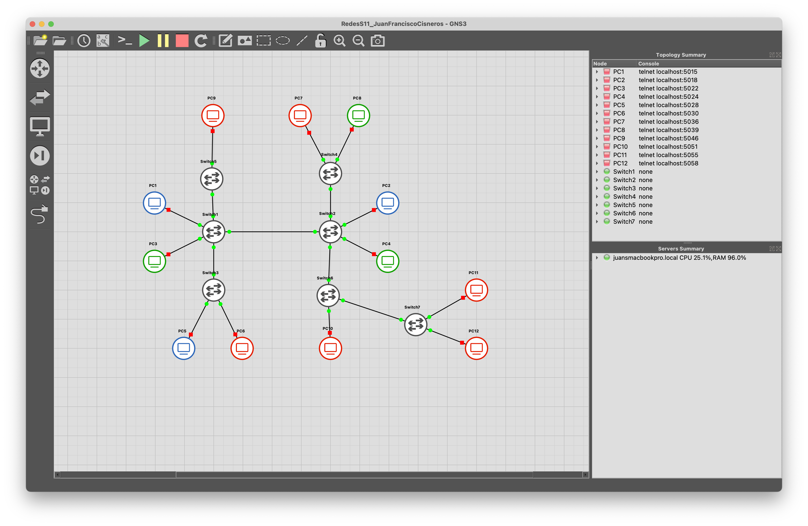
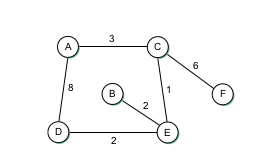

# Study Guide: Computer Networking Chapter 3

### Required reading
Sections: 3.1, 3.2 (except 3.2.2), 3.3, and 3.4

## Switching Basics

### Questions:
1. What is switching in computer networking?

   Switching in computer networking refers to the process of forwarding data frames or packets from one device to another within a network. It involves making decisions based on the destination address in the incoming data and determining the appropriate path for forwarding the information to its destination.

2. Explain the difference between circuit switching and packet switching.

- Circuit Switching:
  - In circuit switching, a dedicated communication path is established between two devices for the entire duration of their conversation.
  - Resources are reserved for the duration of the call, even if no data is being transmitted.
  - Traditional telephone networks often use circuit switching.
- Packet Switching:
  - Packet switching breaks data into smaller packets and sends them independently to the destination, where they are reassembled.
  - Resources are shared dynamically among multiple users.
  - The Internet primarily uses packet switching.

3. What are the advantages of packet switching over circuit switching?

- Efficiency: Packet switching allows for better utilization of network resources as bandwidth is shared among multiple users.
- Flexibility: It supports different types of traffic and can adapt to varying data rates and requirements.
- Cost-Effectiveness: Resources are used more efficiently, reducing costs compared to dedicated circuits.
- Robustness: If a path fails, packets can take alternative routes to reach the destination.

4. What is a switch? How does it differ from a hub?

- Switch:
  - Operates at the data link layer (Layer 2) of the OSI model.
  - Intelligent device that uses MAC addresses to forward frames only to the specific device on the network.
  - Provides better performance and efficiency compared to a hub.
- Hub:
  - Operates at the physical layer (Layer 1) of the OSI model.
  - Broadcasts data to all devices in the network, leading to potential collisions and reduced efficiency.
  - Less intelligent than a switch.

5. Describe the process of switching a packet within a switch.

When a packet arrives at a switch, the switch examines the destination MAC address.
The switch looks up the address in its MAC address table to determine the outgoing port for that address.
If the address is not in the table, the switch broadcasts the packet to all ports (flooding) to learn the address.
The switch then forwards the packet to the appropriate port based on its address table.

6. What is store-and-forward switching? How does it ensure data integrity?

In store-and-forward switching, the switch receives the entire packet before forwarding it to the next device.
The switch checks the packet for errors and ensures its integrity before forwarding.
This method helps in minimizing the impact of errors on the network by not forwarding corrupt packets.
It ensures data integrity by only transmitting error-free packets. If a packet is corrupt, it is discarded rather than forwarded.

### Exercises:
1. Compare and contrast the performance characteristics of circuit switching and packet switching.

**Circuit Switching:**

- Performance Characteristics:
  - Dedicated Path: Establishes a dedicated communication path for the entire duration of a conversation.
  - Fixed Bandwidth: Allocates a fixed amount of bandwidth for the duration of the connection.
  - Low Latency: Provides low latency as the connection is always open.
  - Suitable for Voice: Ideal for real-time applications like voice communication.

**Packet Switching:**

- Performance Characteristics:
  - Shared Path: Shares network resources among multiple users dynamically.
  - Variable Bandwidth: Bandwidth is allocated as needed, providing flexibility.
  - Higher Latency: Latency may be higher due to the need for packet routing and switching.
  - Suitable for Data: Well-suited for bursty data transmission and various types of traffic.

**Comparison:**

- Circuit switching is more suitable for applications that require constant, low-latency connections, such as voice calls.
- Packet switching is more efficient for data transmission, offering flexibility, cost-effectiveness, and adaptability to different traffic types.

2. Research and list three different types of switches commonly used in computer networks.

- Ethernet Switch: Commonly used in local area networks (LANs), an Ethernet switch operates at the data link layer and uses MAC addresses to forward frames. It provides high-speed, full-duplex communication between devices in a LAN.
- Layer 3 Switch (Router Switch): Combining features of a switch and a router, a Layer 3 switch operates at both the data link layer and the network layer. It can perform routing functions, making it suitable for connecting multiple subnets within a network.
- Managed Switch: A managed switch allows for configuration and monitoring of network settings. It provides more control over network traffic, VLANs (Virtual Local Area Networks), and Quality of Service (QoS) settings. Managed switches are often used in larger and more complex network setups.

3. Design a simple network topology using switches to connect multiple computers. Label the switches and computers in your diagram.

## Switched Ethernet

### Questions:
1. What is Ethernet? How does it work?
- Ethernet is a widely used networking technology for connecting computers and other devices in a local area network (LAN).
- It operates at the data link layer (Layer 2) of the OSI model and uses a protocol to control how data packets are placed on the network.
  - Devices on an Ethernet network communicate using Ethernet frames.
  - Each device on the network has a unique identifier called a MAC (Media Access Control) address.
  - Ethernet uses CSMA/CD (Carrier Sense Multiple Access with Collision Detection) for managing access to the network. Devices listen to the network, wait for it to be clear, and then send data. If a collision is detected, devices involved in the collision wait for random intervals before attempting to resend.

2. Explain the concept of a collision domain in Ethernet.
- A collision domain is a network segment where data packets can collide with each other when transmitted simultaneously by multiple devices.
- In Ethernet, collisions can occur in a shared medium where multiple devices are connected to the same segment or network segment.
- Collisions can lead to data corruption and result in the need for retransmission.
  - In a hub-based network, all devices share the same collision domain. When one device transmits, all other devices on the same hub segment receive the signal.
  - In a switch-based network, each port of the switch is a separate collision domain, reducing the likelihood of collisions. Devices connected to different ports can transmit simultaneously without interfering with each other.
3. What are learning bridges?
- Learning bridges are network devices that operate at the data link layer (Layer 2) of the OSI model.
- They are a type of bridge that dynamically builds and maintains a table of MAC addresses and their corresponding port locations.
- Learning bridges use this MAC address table to make forwarding decisions, improving the efficiency of data transmission within a network.
  - When a frame arrives at a learning bridge, it examines the source MAC address and associates it with the port through which the frame arrived.
  - The bridge updates its MAC address table with this information.
  - Subsequent frames with known MAC addresses are forwarded only to the port where the destination device is located, reducing unnecessary traffic on the network.

4. Explain the Spanning Tree Algorithm

- The Spanning Tree Algorithm is used in Ethernet networks to prevent loops in the topology, which could cause broadcast storms and degrade network performance.
- It is part of the IEEE 802.1D standard and is commonly used in Ethernet networks that have redundant paths.
  - The algorithm designates one switch as the root of the spanning tree.
  - It then selects the best path to the root for each switch, blocking redundant paths to prevent loops.
  - If a link failure occurs, the algorithm dynamically adjusts the spanning tree to maintain network connectivity without loops.

5. What are VLANs?
- VLANs are a way to logically segment a physical network into multiple virtual networks.
- Devices in the same VLAN can communicate as if they are on the same physical network, even if they are located on different network segments.
- VLANs help improve network security, performance, and management flexibility.
  - Devices within a VLAN can communicate with each other as if they are on the same physical network, regardless of their physical location.
  - VLANs are configured on switches, and devices are assigned to VLANs based on factors such as port, MAC address, or protocol.
  - VLANs are often used to separate broadcast domains, enhance network security by isolating traffic, and simplify network management.

## Internet (IP)

### Questions:
1. What is the Internet Protocol (IP)? How does it work?

- The Internet Protocol (IP) is a set of rules and conventions that govern how data packets should be sent, routed, and received across networks.
- It is a fundamental protocol in the Internet protocol suite (TCP/IP) and provides the addressing and routing information for data transmission.
  - IP assigns a unique address to each device on a network, known as an IP address.
  - When a device wants to send data to another device, it encapsulates the data into IP packets, including the source and destination IP addresses.
  - Routers use the destination IP address to forward the packets toward their destination across interconnected networks.

2. Explain the difference between IPv4 and IPv6.

- IPv4:
  - 32-bit address
  - 4 decimal numbers separated by dots
- IPv6:
  - 128-bit address
  - 8 hexadecimal numbers separated by colons

3. What is an IP address? How is it structured?

- An IP address is a numerical label assigned to each device connected to a computer network that uses the Internet Protocol for communication.
- It serves two primary functions: host or network interface identification and location addressing.
  - In IPv4, an IP address consists of four octets (8 bits each), separated by dots (e.g., 192.168.1.1).
  - In IPv6, an IP address consists of eight groups of four hexadecimal digits, separated by colons (e.g., 2001:0db8:85a3:0000:0000:8a2e:0370:7334).

4. What is the purpose of subnetting in IP addressing?

- Subnetting is the process of dividing a larger network into smaller, more manageable sub-networks or subnets.
- It helps in optimizing network performance, improving security, and simplifying network management.
  - Efficiently use IP address space.
  - Contain broadcast domains, reducing network traffic.
  - Enhance security by isolating different parts of the network.
  - Simplify network management and troubleshooting.

5. Describe the process of IP packet forwarding.

When a device wants to send data to another device, it encapsulates the data into an IP packet.
The device checks the destination IP address and compares it with its own IP address and subnet mask to determine if the destination is on the local network.
If the destination is on a different network, the device sends the packet to the default gateway (router).
Routers use the destination IP address to determine the next hop and forward the packet toward its destination.
The process repeats until the packet reaches the destination network.

6. What is the role of the Internet Control Message Protocol (ICMP) in IP?

-ICMP is a network layer protocol that provides error reporting, diagnostics, and other control messages in IP networks.

**Roles of ICMP:** 

- Error Reporting: Used by routers and hosts to report errors in packet processing.
- Ping: ICMP Echo Request and Echo Reply messages are used for network testing and troubleshooting.
- Path MTU Discovery: Helps determine the maximum transmission unit (MTU) size along a network path.
- Router Discovery: Helps hosts discover routers on the local network.

### Exercises:
1. Convert the following IPv4 address to binary: 192.168.0.1.
- 11000000.10101000.00000000.00000001

2. Research and list three different classes of IP addresses.

- Class A: 10.0.0.0 to 10.255.255.255
- Class B: 172.16.0.0 to 172.31.255.255
- Class C: 192.168.0.0 to 192.168.255.255

https://www.ibm.com/docs/es/networkmanager/4.2.0?topic=translation-private-address-ranges

3. Configure a computer to use a static IP address. Document the steps you followed.

### Configure a Static IP Address on Mac:

1. **Open System Preferences:**
  - Click on the Apple logo in the top-left corner of the screen.
  - Select "System Preferences."

2. **Go to Network Settings:**
  - In the System Preferences window, click on "Network."

3. **Select Network Connection:**
  - Choose the network connection you want to configure on the left sidebar (e.g., Wi-Fi or Ethernet).

4. **Click on "Advanced...":**
  - Click the "Advanced..." button in the lower-right corner.

5. **Navigate to TCP/IP Tab:**
  - In the Advanced window, go to the "TCP/IP" tab.

6. **Configure IPv4:**
  - Choose "Using DHCP" from the "Configure IPv4" dropdown menu.
  - Change it to "Manually" to set a static IP address.

7. **Enter IP Address and Subnet Mask:**
  - Enter the desired static IP address in the "IPv4 Address" field.
  - Enter the corresponding subnet mask in the "Subnet Mask" field.

8. **Configure Router (Optional):**
  - If necessary, enter the IP address of your router (gateway) in the "Router" field.

9. **Configure DNS (Optional):**
  - Go to the "DNS" tab if you need to configure DNS servers.
  - Add DNS server addresses in the "DNS Servers" list.

10. **Click "OK" to Apply Changes:**
  - Click "OK" to close the Advanced window.

11. **Apply Changes in Network Preferences:**
  - Back in the main Network window, click the "Apply" button.

12. **Verify Configuration:**
  - Open a Terminal window and use the command `ifconfig` to verify that the computer has the configured static IP address.

## Routing

### Questions:
1. What is routing in computer networking?

**Routing:**
- Routing is the process of directing data packets between different networks or subnetworks to reach their destination.
- Routers are devices responsible for making decisions about the path that packets should take to reach their intended destination.

2. Explain the difference between static routing and dynamic routing.

**Static Routing:**
- **Definition:** In static routing, network administrators manually configure the routes in the router's routing table.
- **Characteristics:**
  - Routes are manually set and do not change unless modified by administrators.
  - Suitable for small networks with simple and predictable topologies.
  - Requires less computational overhead.

**Dynamic Routing:**
- **Definition:** Dynamic routing protocols allow routers to communicate with each other, automatically sharing information about the network topology.
- **Characteristics:**
  - Routing tables are dynamically updated based on real-time information.
  - Well-suited for large, complex networks with dynamic changes in topology.
  - Provides adaptability to network changes.

3. What is a routing table? How is it used in the routing process?

**Routing Table:**
- A routing table is a data structure stored in a router that contains information about the available paths to reach various network destinations.
- It includes entries specifying network destinations, associated next-hop routers, and routing metrics.

**Usage in Routing Process:**
1. **Destination Lookup:**
  - When a router receives a packet, it looks at the destination IP address.
  - The routing table is consulted to find the best match for the destination IP address.

2. **Next-Hop Determination:**
  - The router identifies the next-hop router, the interface through which the packet should be forwarded.

3. **Forwarding Decision:**
  - Based on the routing table information, the router forwards the packet to the selected next-hop or directly to the destination.

4. What is the purpose of a default gateway in routing?

**Default Gateway:**
- The default gateway is the router to which a device sends packets if the destination IP address is outside its local subnet.
- It serves as the gateway of last resort when a device needs to communicate with a host on another network.

**Purpose:**
- Provides a way for devices within a local network to access external networks.
- Handles traffic that is not destined for a device within the local subnet.
- Allows devices to communicate with hosts on different subnets or external networks.

5. Describe the process of routing a packet from source to destination.

**Routing a Packet from Source to Destination:**
1. **Source Device:**
  - The source device determines the destination IP address of the packet.

2. **Routing Decision:**
  - The source device checks its local routing table to determine if the destination is on the same subnet or requires routing.

3. **Local Subnet or Different Subnet:**
  - If the destination is on the same subnet, the source device communicates directly. Otherwise, it needs routing.

4. **Routing Table Lookup:**
  - The source device checks its routing table to find the next-hop router or default gateway for the destination network.

5. **Next-Hop Determination:**
  - The source device encapsulates the packet and sends it to the next-hop router, which is determined based on the routing table.

6. **Intermediate Routers:**
  - Intermediate routers along the path perform similar steps, determining the next-hop until the packet reaches the final destination.

7. **Destination Device:**
  - The packet arrives at the destination network, and the final router delivers it to the destination device based on the destination IP address.

8. **Communication:**
  - The destination device processes the incoming packet, and if necessary, responds by sending packets back through the same routing process.

## Exercises

1. For the network given in figure above, show how the link-state algorithm builds the routing table for node D.

| Step | Confirmed | Tentative      |
|------|-----------|----------------|
| 1    | (D,0,-)   |                |
| 2    | (D,0,-)   | (E,2,E)(A,8,A) |
| 3    | (D,0,-)(E,2,E)| (A,8,A)        |
| 4    | (D,0,-)(E,2,E) | (B,4,E)(C,3,E) |
| 5    | (D,0,-)(E,2,E)(B,4,E)(C,3,E) |                |
| 6    | (D,0,-)(E,2,E)(B,4,E)(C,3,E) | (F,9,C)(A,6,C) |
| 7    | (D,0,-)(E,2,E)(B,4,E)(C,3,E)(F,9,C)(A,6,C) |  |

